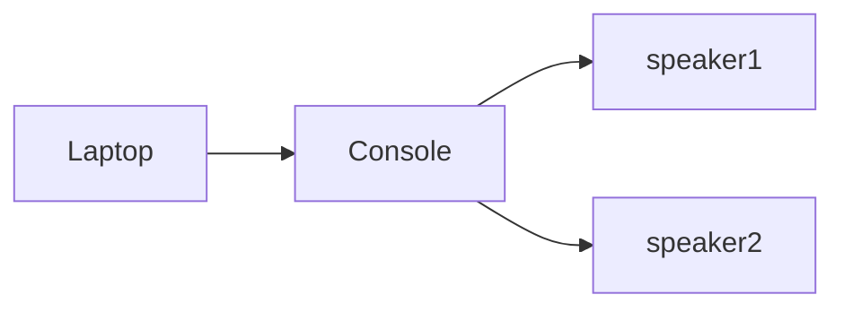
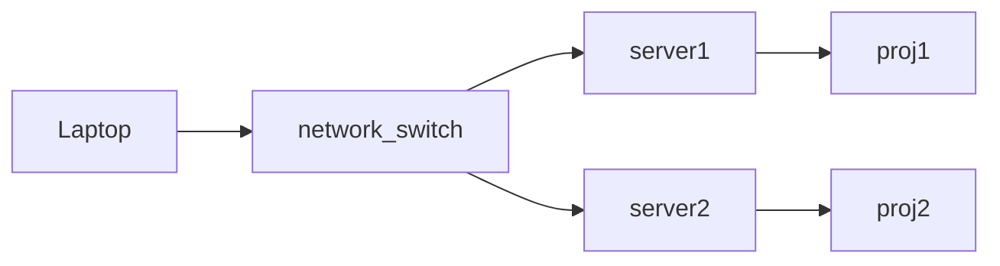
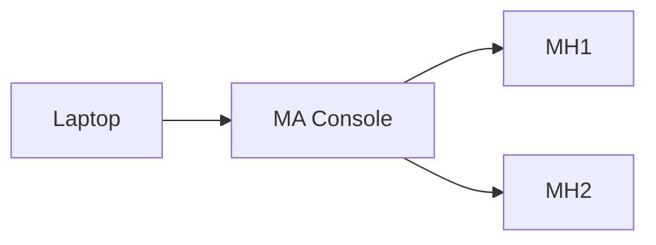

# EGL315-Lux-gram-Team-A 
## **Ideation**

## **System Diagram**

### Report

Link: https://docs.google.com/document/d/1cRA3Jf9vpwHjMYrJQF2hUuMFDghb2m2GhYB-DNqmJVI/edit

### Audio

### Video

### Lighting

## **Research on light**
angle of incidence is the angle of which the directed light source is pointed at the normal
critical angle is the angle of the ray when the light reflected is at 90 degrees

### Refraction 

first diagram is when angle of incidence < criticle angle, so when it moves to a new medium, it refracts (break/tilt)

### critical angle

Second is when angle of incidence = crit angle so no refraction

### total internal reflection

Third is when angle of incidence > criticdle angle, so  quite literally internally reflected (NOT REFRACTED)

### Formulas 
Refractive Index -->  n = c/v
where n is refractive index,
c is speed of light in vacumm / air
v is speed of light in Medium / Acrylic

Snell's law
n1 sin x1 = n2 sin x2
where n1 == incident Refractive Index
where n2 == refracted Refractive Index

where x1 == incident angle
where x2 == refracted angle

### complilation

total internal reflection occurs when the ray of incidence's angle is higher than the critical angle

*Reference Link: https://www.youtube.com/watch?v=zA8UfR-Eekk*

