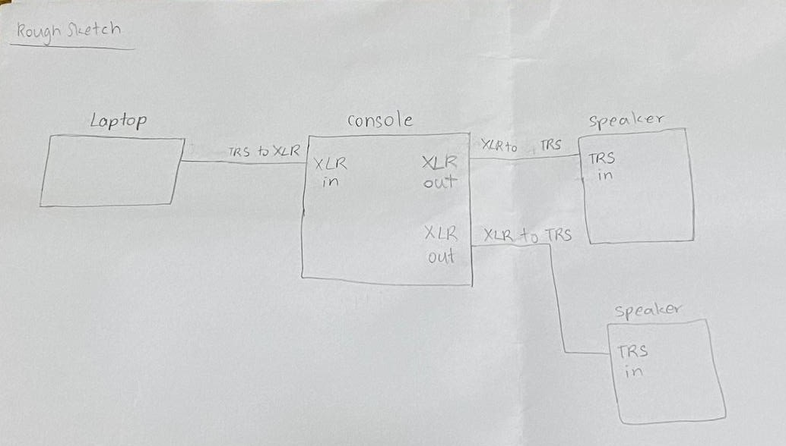
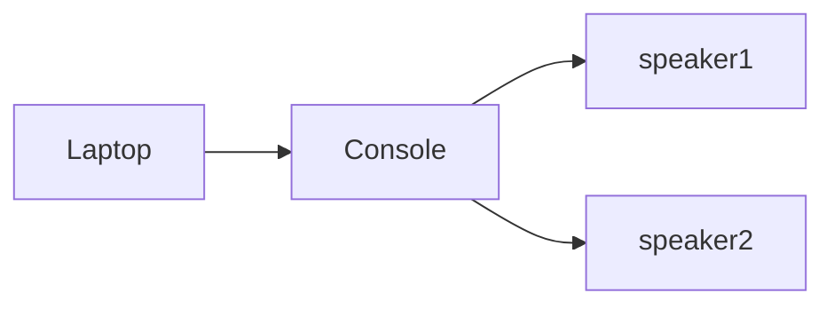
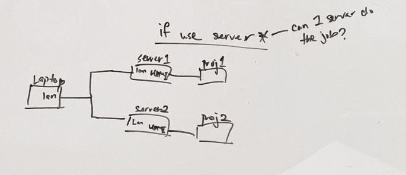
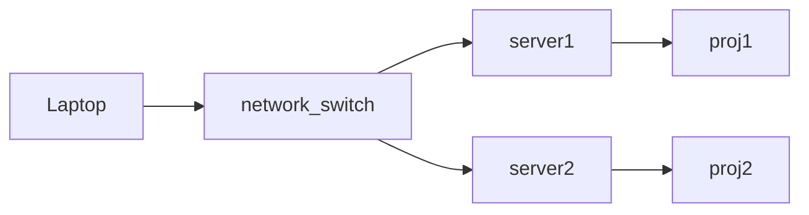
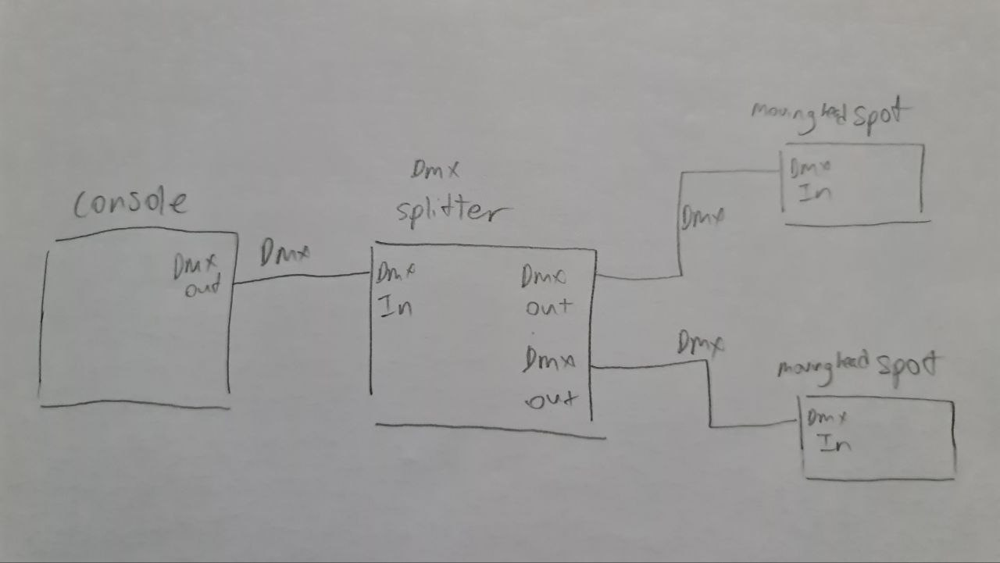
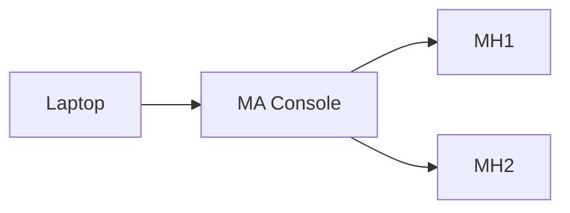
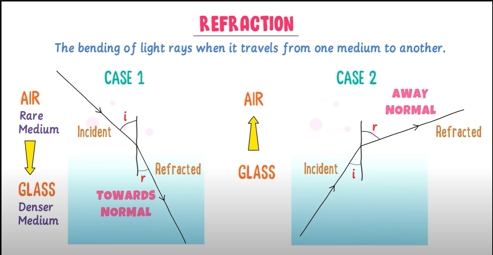
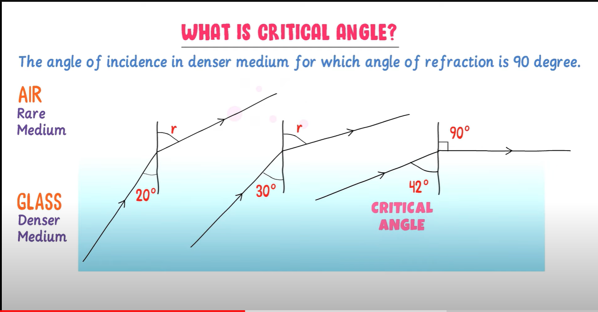
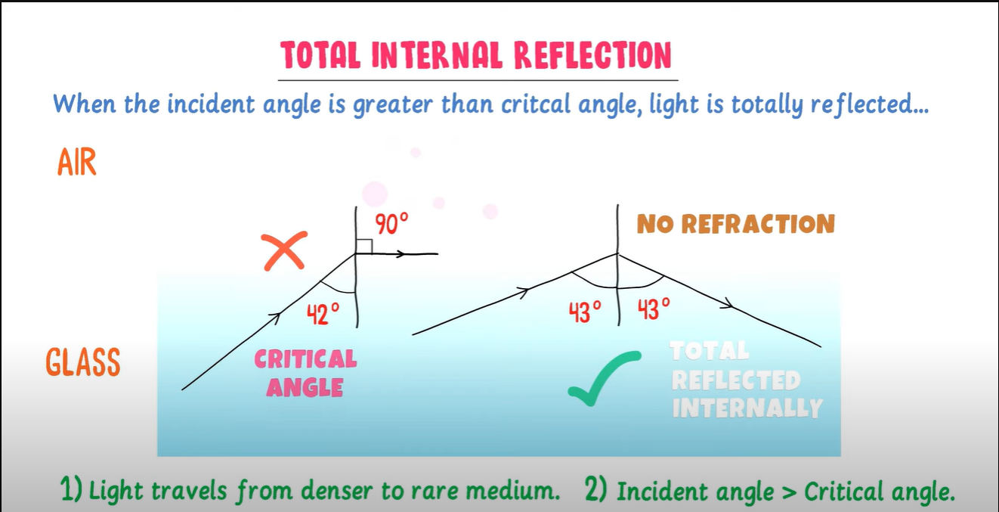
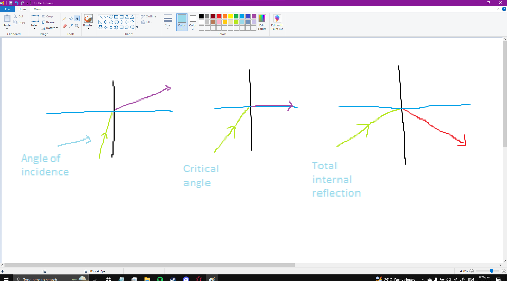

# EGL315-Lux-gram-Team-A 
## **Ideation**

## **System Diagram**

### Report

Link: https://docs.google.com/document/d/1cRA3Jf9vpwHjMYrJQF2hUuMFDghb2m2GhYB-DNqmJVI/edit

### Audio

### Video

### Lighting

## **Research on light**
angle of incidence is the angle of which the directed light source is pointed at the normal
critical angle is the angle of the ray when the light reflected is at 90 degrees

### Refraction 

first diagram is when angle of incidence < criticle angle, so when it moves to a new medium, it refracts (break/tilt)

### critical angle

Second is when angle of incidence = crit angle so no refraction

### total internal reflection

Third is when angle of incidence > criticdle angle, so  quite literally internally reflected (NOT REFRACTED)

### Formulas 
Refractive Index -->  n = c/v
where n is refractive index,
c is speed of light in vacumm / air
v is speed of light in Medium / Acrylic

Snell's law
n1 sin x1 = n2 sin x2
where n1 == incident Refractive Index
where n2 == refracted Refractive Index

where x1 == incident angle
where x2 == refracted angle

### complilation

total internal reflection occurs when the ray of incidence's angle is higher than the critical angle

*Reference Link: https://www.youtube.com/watch?v=zA8UfR-Eekk*

## **Research on Pepper Ghost**

**Basic Understanding**

Illustration technique to exploit virtual images

Used in various areas such as:
  
  * Theatre
  * Cinema
  * Amusement Park
  * Museum
  * Television 
  * Concert
  
How does the illustration work?

  * When the light wabes bounce off from one surface to another, an image is reflected
  * One surface is seen by the audience while the other surface is hidden
  * The glass can be held at a certain angle

Can take less technology compared to hologram

Reference Links:

* https://www.scienceworld.ca/resource/peppers-ghost-hologram-illusion/

* https://en.wikipedia.org/wiki/Pepper%27s_ghost

**Contrast**

* https://epson.com/projector-guide-how-to-buy-a-projector-contrast-ratio#:~:text=Contrast%20ratio%20is%20the%20difference,will%20get%20the%20contrast%20ratio.

* https://www.quora.com/Has-anyone-made-a-hologram-projector-Peppers-ghost-concept-using-a-projector-instead-of-monitors-other-displays-If-yes-how-did-you-make-the-projected-image-sharp

* https://www.viewsonic.com/library/tech/what-are-lumens-and-how-to-use-them-to-choose-a-projector/

* https://opg.optica.org/oe/fulltext.cfm?uri=oe-28-26-39524&id=444799

* https://www.artofplay.com/blogs/stories/spectral-illusions-the-peppers-ghost-effect-and-how-it-works

* https://www.projectorcentral.com/projector-contrast-ratio.htm#:~:text=What%20is%20Projector%20Contrast%20Ratio,brighter%20than%20the%20black%20image.

* https://yourbusiness.azcentral.com/importance-contrast-projector-3962.html

* https://projectorninja.com/good-contrast-ratio-projector/

* https://pointerclicker.com/what-contrast-ratio-is-best-for-projector/

**Brightness**

Contains properties of the clear vision for reconstruction from the source of light which extends the vertical view of the aperture of the scene depth

Colour of the hologram components consist of the array of the noncontiguous of small dots along with thin strips

Changing image formatting beightness along with the image formatting contrast enhance the encode of the hologram

* For example, higher makes the 3D images more predictable 

Reference Links:

* https://bohatala.com/what-is-pepper-ghost-technique/

* https://ieeexplore.ieee.org/document/9289217

* https://opg.optica.org/abstract.cfm?uri=3D-2022-3F2A.6

* https://www.researchgate.net/publication/250998118_Design_of_Hologram_for_Brightness_Enhancement_in_Color_LCDs

* https://www.benq.com/en-sg/knowledge-center/knowledge/projector-brightness-lumens.html

* https://epson.com/projector-guide-how-to-buy-a-projector-color-brightness#:~:text=Projector%20brightness%20is%20measured%20in,of%202500%20lumens%20is%20best

* https://www.projectorpeople.com/resources/lumen-guide.asp

* https://www.projectorcentral.com/How-Bright-Should-Your-Projector-Be.htm

* https://www.wemax.com/blogs/tutorials/10-ways-to-make-your-projector-brighter

* https://www.projectorscreen.com/blog/How-Many-Lumens-Do-I-Need-For-A-Projector
