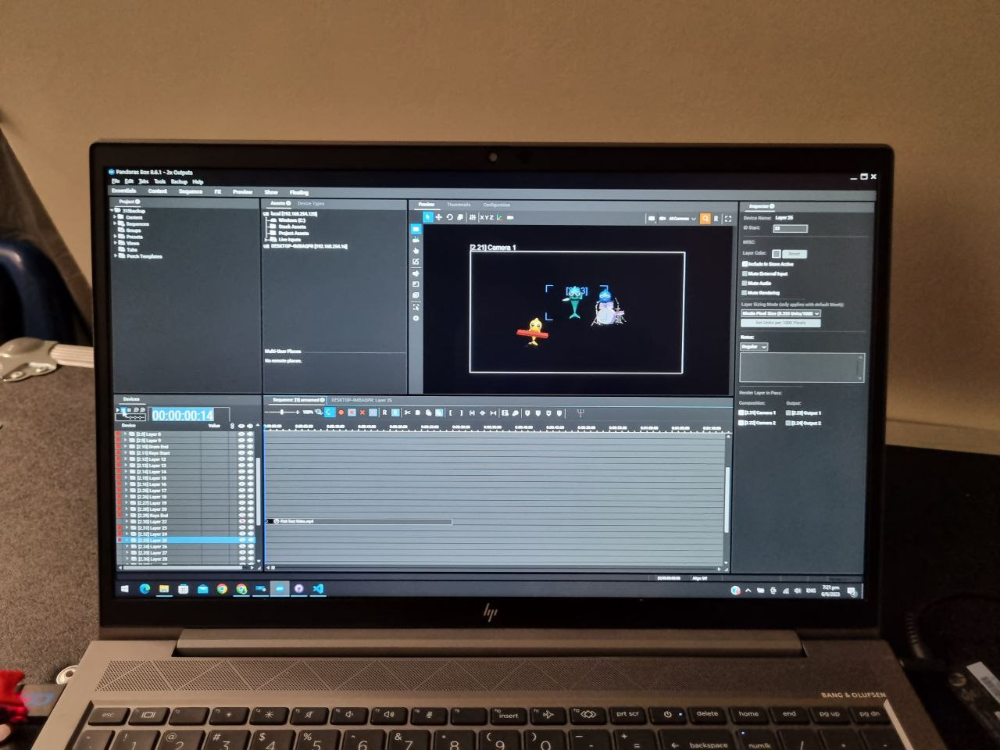
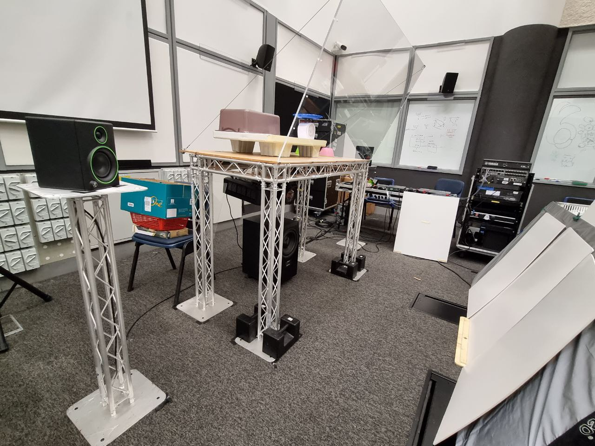

# Set up guide to create a pepper's ghost

## Required materials

To know what items are required for this setup, please read the BOM listed below.

1. 1x Projector Epson EB-PU2010B
2. 1x Network Switch Cisco SG1100D-08HP
3. 1x Audio Mixer Yamaha QL1
4. 1x Ma3 2 Port Node
5. 1x Media Server
6. 3x Laptop Hp Zbook G5 15
7. 2x Spot MH Ayrton Mistral
8. 1x SaCN to DMX converter Luminex Luminode 4
9. 1x Audio Amplifier Kramer 914
10. 2x Passive speakers Mackie CR4
11. 1x Active Subwoofer Adam Sub10 
12. 1x Hinged acrylic 80cm x 110cm  
13. 3x White polyfoam 270cm x 120cm x 0.5cm

## Required Softwares and Licenses

1. Christie's Pandoras Box
2. Pandora Server Management
3. Pro tools
4. Dante Virtual Soundcard
5. Dante Controller
6. grandMA3
7. Dongle for pandora licensing
8. Dongle for Pro Tools licensing

## How to start

### **Pepper's ghost set up**

Using a sturdy and heavy enough frame, mount the projector to the underside of the frame, then angle the projector 10° towards the floor.

Then, at 100cm away, prop up the white polyfoam, and tilt it backwards to an angle of 68°.

Above the frame, place and open the acrylic, then secure it while angling it at 75°.

### **Video system set up**

Connect 1 laptop to your media server via a LAN cable, then a HDMI cable to your projector set up previously.

Ensure the ip addresses for your laptop and media server are in the same subnet.

Connect the licensing dongle for Pandora to your laptop, then launch pandoras box on and server management.

On your media server, launch pandoras box, then enter fullscreen.

You can now start sending in content through your laptop to your media server.

### **Lighting system set up**

Connect 1 laptop to a ma3 two-port node via a LAN cable, then connect the two-port node to a SaCN to DMX converter via a LAN cable.

Ensure the ip addresses for your laptop and ma3 Two-port Node are in the same subnet.

Connect your two Spot Moving heads to the DMX converter via DMX cables.

Launch grandma3 on your laptop and you can now start creating cues in your lighting system.

### **Audio System set up**

Start by patching an amplifier in your QL1, then connecting two passive speakers into the amplifier.

Then, patch a subwoofer in your QL1.

Connect 1 laptop to your Yamaha QL1 via a LAN cable.

Ensure the ip addresses for your laptop and QL1 are in the same subnet.

Connect the licensing dongle for Pro Tools to your laptop, then launch Pro Tools, Dante Virtual Soundcard and Dante controller. 

