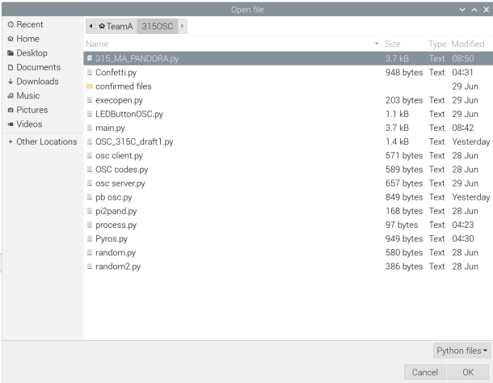

# EGL315-Lux-gram-Team-A

# Raspberry Pi

## Raspberry Pi Configuration

Download and install raspbian  


Choose the operating system as Raspberry Pi OS (32-bit)  


Choose the storage device, being the SD card that will be used to store data for the Raspberry Pi  


Pick advanced options, enable hostname and SSH, then enter a hostname of your choosing, in this case, its TeamA2  


Enable set username and password then create a username and password, in this senario username being TeamA2, password being mtswifipwd  


Enable Configure wireless LAN and enter the SSID and password according to the SSID and password according what was configured in the netgear router  


Select write  


Note that the SD card will be formatted and everything in it will be erased, do not use a SD card will has data in it  


Wait for raspbian to fishing writing  


Now you can remove the SD card from your laptop and insert it into the raspberry pi  


After the Raspberry Pi finishes starting up, go the command terminal, and type the command "ifconfig" and look for the the ip address of the raspberry pi, in this case being 192.168.10.4  

Use the command sudo raspi-config and enable VNC  


Download and install VNC viewer, enter the ip address of the raspberry pi  


Login to raspberry pi  


# Guide for python codes in Raspberry Pi

## Running OSC to MA3 and Pandora

### 1. Open Thonny in Rapberry Pi

### 2. Using the code  
- Import the [program file](<../Codes/OSC_MA_PANDORA.py>) and open in Thonny



## Code Breakdown
### Setup

This portion of the code sets up the program, inclusive of importing of libraries, UDP ports and IP for osc communication and setup of the GPIO board for the physical buttons
```
from pythonosc import udp_client
import socket
import RPi.GPIO as GPIO
import time
import subprocess

#Pandora IP and UDP port(L : socket)
Pan_IP = "192.168.200.7"
Pan_port = 10000

#MA3 IP and UDP port(L : pythonosc)
MA_IP = "192.168.200.73"
MA_port = 8000

# Set up of the GPIO pins and button state
GPIO.setmode(GPIO.BCM)
GPIO.setwarnings(False)
button_pin = 27
Fbutton_pin = 26
GPIO.setup(Fbutton_pin, GPIO.IN, pull_up_down=GPIO.PUD_UP)
GPIO.setup(14,GPIO.OUT)
GPIO.setup(button_pin, GPIO.IN, pull_up_down=GPIO.PUD_UP)
GPIO.output(14,0)
push_flag = 0

##Link with Pandora(L : socket)
s = socket.socket(socket.AF_INET, socket.SOCK_DGRAM)
s.connect((Pan_IP, Pan_port))
```
This portion of the code uses the UDP ports and IPs defined previously to communicate with the MA3 software and Widget designer to send commands through OSC
```
##Function to link with MA3 and send message with feedback included(L : pythonosc)
def send_message(receiver_ip, receiver_port, address, message):
	try:
		# Create an OSC client to send messages
		client = udp_client.SimpleUDPClient(receiver_ip, receiver_port)
		# Send an OSC message to the receiver
		client.send_message(address,message)
		print("Message sent successfully.")
	except:
		print("Message not sent")


#send desired message to MA3(L : pythonosc)
Pan_msg = b"UDPSend(1,'{wdcustomscriptclick(8)}')!"
s.sendto(Pan_msg,(Pan_IP, Pan_port))
addr = "/gma3/cmd"
MA_msg = "Go+ Sequence 4 Cue 1"
send_message(MA_IP,MA_port,addr,MA_msg)
```
This portion of the code is the main logic that runs the show, with UDP messages triggering the lighting cues and Custom Scripts in Widget Designer
```
Pan_msg = b"UDPSend(1,'{wdcustomscriptclick(8)}')!"
s.sendto(Pan_msg,(Pan_IP, Pan_port))
MA_msg = "Go+ Sequence 4 Cue 1"
send_message(MA_IP,MA_port,addr,MA_msg)
# time.sleep(30)

print("btn ready")
MA_msg = "Go+ Sequence 4 Cue 2"
send_message(MA_IP,MA_port,addr,MA_msg)

while True:
    if GPIO.input(Fbutton_pin) == GPIO.LOW:
        Pan_msg = b"UDPSend(1,'{wdcustomscriptclick(1)}')!"
        s.sendto(Pan_msg,(Pan_IP, Pan_port))
        MA_msg = "Go+ Sequence 4 Cue 3"
        send_message(MA_IP,MA_port,addr,MA_msg)
        time.sleep(10)
        GPIO.output(14,1) 
    
    elif GPIO.input(button_pin) == GPIO.LOW:
        if push_flag == 0:
            GPIO.output(14,0)
            print("bye")
            ## block end
            Pan_msg = b"UDPSend(1,'{wdcustomscriptclick(2)}')!"
            s.sendto(Pan_msg,(Pan_IP, Pan_port))
            push_flag = 1
            MA_msg = "Go+ Sequence 4 Cue 4"
            send_message(MA_IP,MA_port,addr,MA_msg)
            time.sleep(2.42)
            MA_msg = "Go+ Sequence 4 Cue 5"
            send_message(MA_IP,MA_port,addr,MA_msg)
            time.sleep(47.06)
            MA_msg = "Go+ Sequence 4 Cue 6"
            send_message(MA_IP,MA_port,addr,MA_msg)
            time.sleep(19.51)
            MA_msg = "Go+ Sequence 4 Cue 7"
            send_message(MA_IP,MA_port,addr,MA_msg)
#             time.sleep(19.51)
            MA_msg = "Off Sequence 4"
            send_message(MA_IP,MA_port,addr,MA_msg)
            Pan_msg = b"UDPSend(1,'{wdcustomscriptclick(8)}')!"
            s.sendto(Pan_msg,(Pan_IP, Pan_port))
#             subprocess.run(["python","process.py"])
            break
        else:
            ## block end
            push_flag = 0
        time.sleep(0.5)
```


