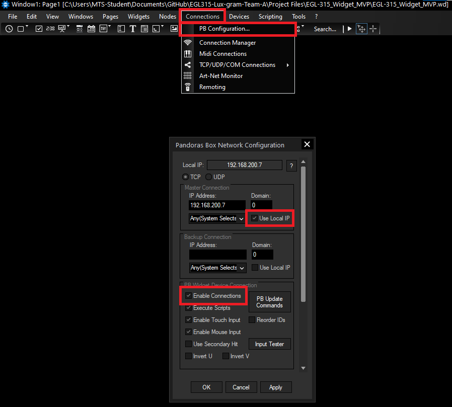
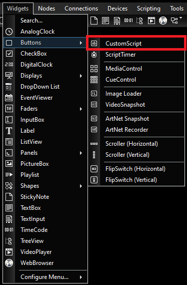
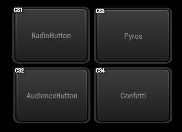
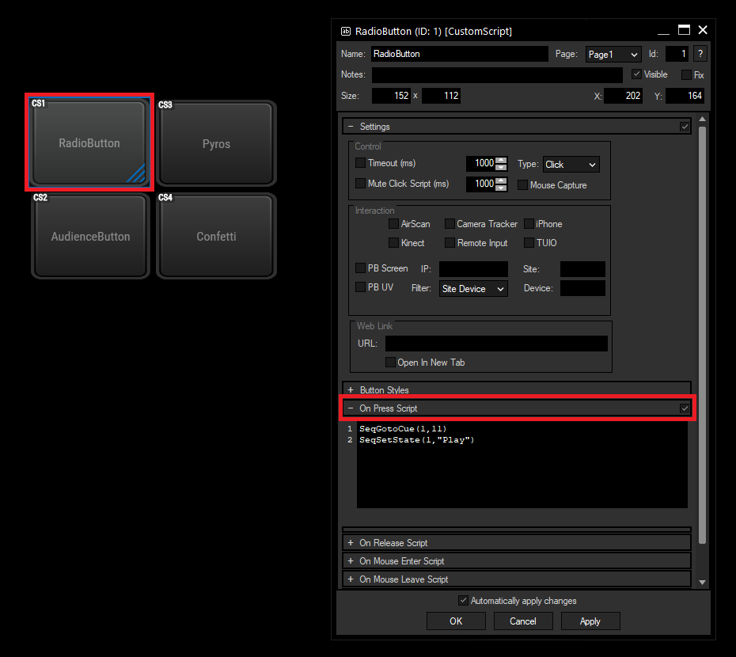

# EGL315-Lux-gram-Team-A

# Guide for python codes in Raspberry Pi

## Giving commands to Pandoras Box via Widget Designer

### 1. Open up the Connections tab in Widget designer > PB Connections



Ensure that Local IP is enabled for your master connection and Your connection is enabled under PB Widget Device Connection

### 2. Navigate to the Widget Tab > Buttons > CustomScript



Add 2 (Radio and Audience) buttons and label them accordingly
Pyros and Confetti buttons are not used for now




### 3. Scripting
Double Click the button you created and open up On Press Script





**Paste the line of code corresponding to the button you labelled**

1. Radio Button
```
SeqGotoCue(1,11)
SeqSetState(1,"Play")
```


2. Audience Button
```
SeqGotoCue(1,12)
SeqSetState(1,"Play")
UdpSend(7,"Go+ Sequence 4")
```